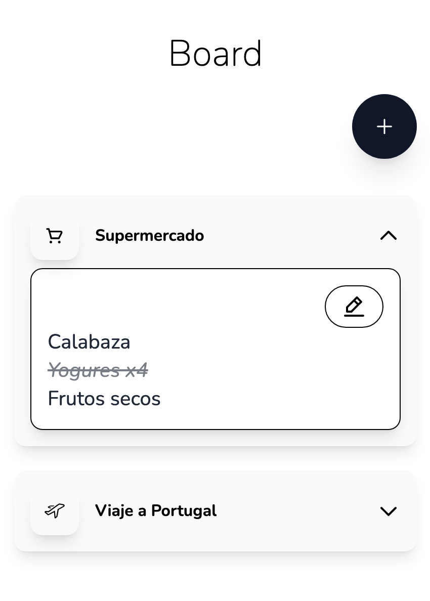

# Taskflow

Aplicación de gestión de tareas construida con React, TypeScript y Tailwind CSS v4. Permite crear listas de tareas personalizadas con iconos y organizar tareas de forma visual.



## Requisitos Previos

- Node.js (versión 16 o superior)
- npm o yarn

## Instalación

1. Clona el repositorio:
```bash
git clone <repository-url>
cd my-task-board
```

2. Instala las dependencias:
```bash
npm install
```

## Comandos Disponibles

### Desarrollo

Inicia el servidor de desarrollo:
```bash
npm run dev
```
La aplicación estará disponible en `http://localhost:5173`

### Compilación

Compila el proyecto para producción:
```bash
npm run build
```

### Vista Previa

Previsualiza la compilación de producción:
```bash
npm run preview
```

### Linting

Ejecuta el linter:
```bash
npm run lint
```

Ejecuta el linter y corrige errores automáticamente:
```bash
npm run lint:fix
```

### Formateo

Formatea el código:
```bash
npm run format
```

Verifica el formato del código:
```bash
npm run format:check
```

## Stack Tecnológico

- **React 19** - Librería de UI
- **TypeScript** - Tipado estático
- **Vite 7** - Herramienta de compilación
- **Tailwind CSS v4** - Framework de estilos
- **React Hook Form** - Gestión de formularios
- **ESLint + Prettier** - Linting y formateo

## Estructura del Proyecto

```
src/
├── components/ui/     # Componentes reutilizables de UI
│   ├── Button/       # Componente de botón
│   ├── Card/         # Tarjeta de lista de tareas
│   ├── Dialog/       # Componente modal
│   ├── Emoji/        # Selector de emojis
│   └── Form/         # Formulario de creación de listas
├── App.tsx           # Componente principal
├── main.tsx          # Punto de entrada
└── index.css         # Estilos de Tailwind
```